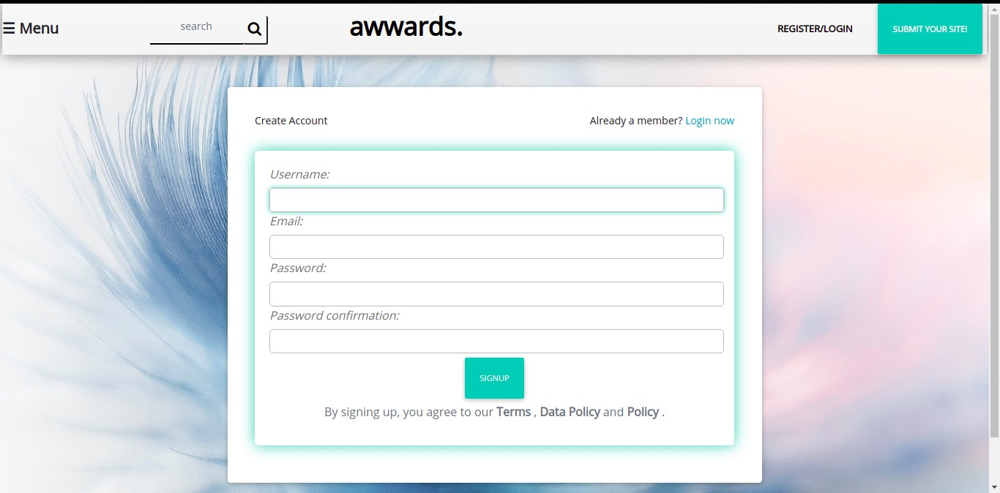
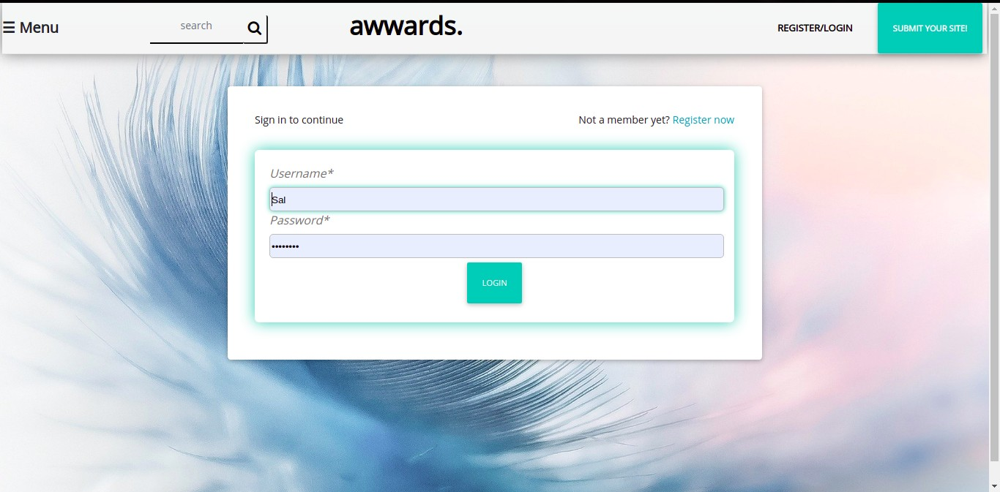
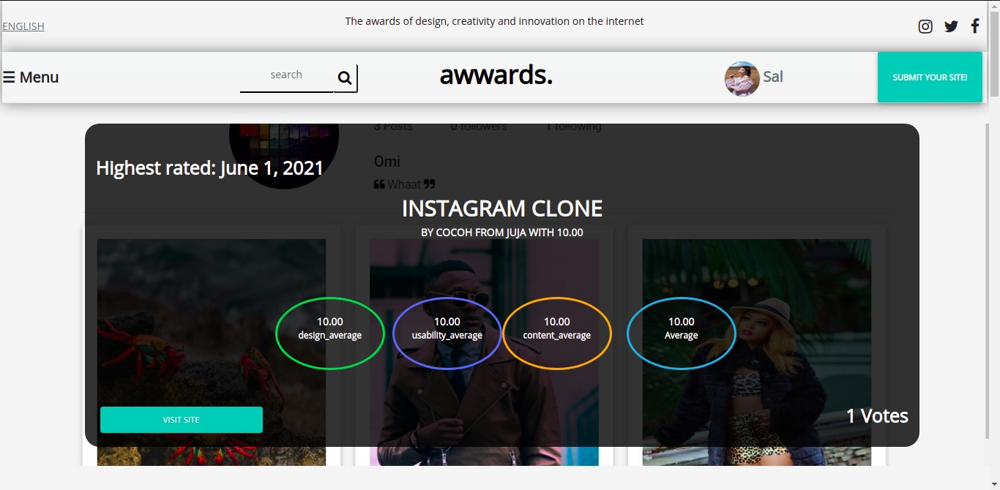
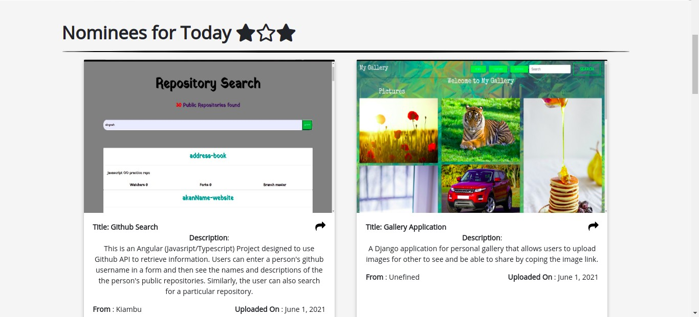
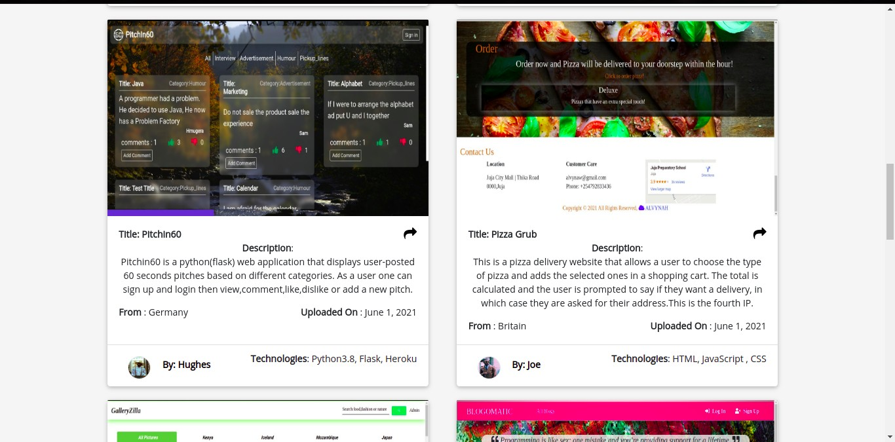
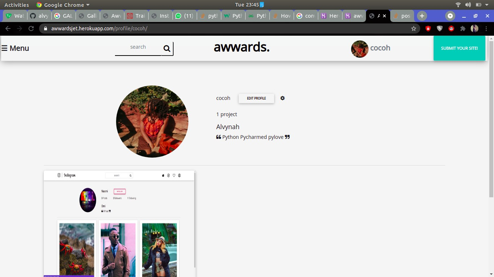
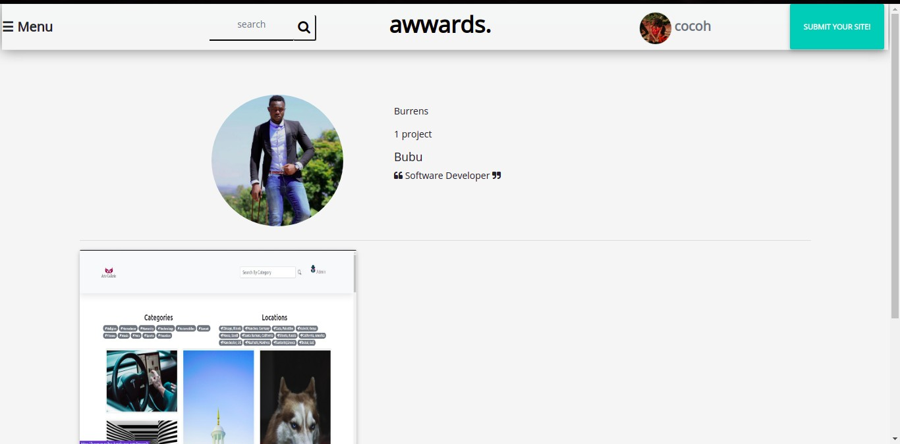
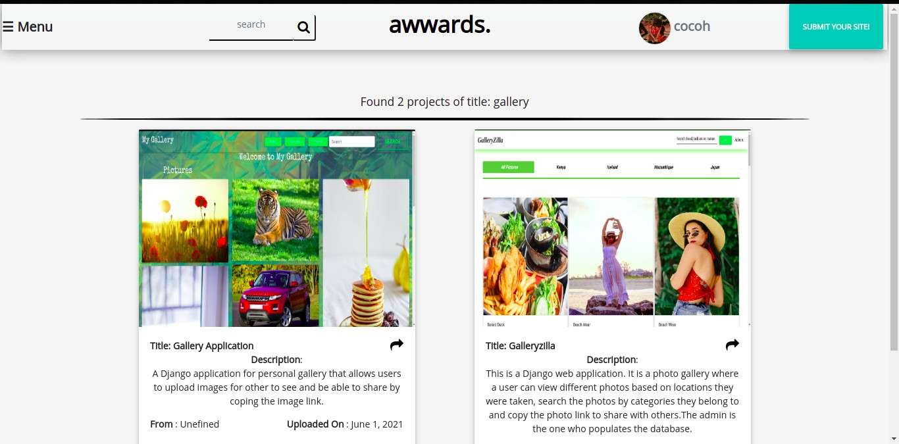
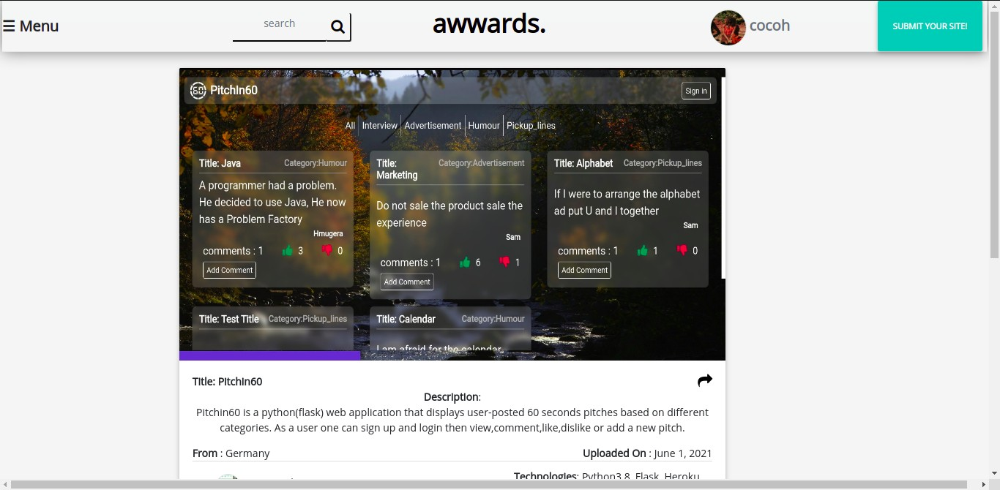
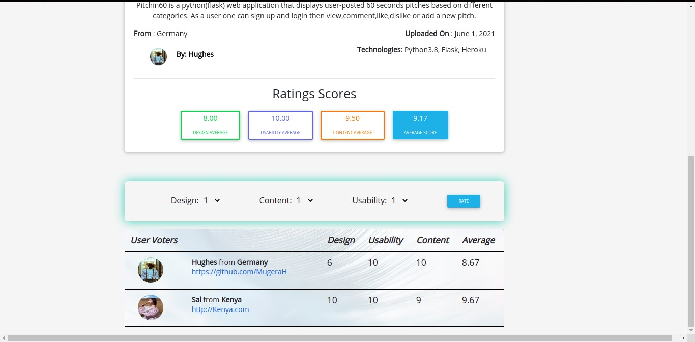

# Instagram Clone 

## Author
 [Alvynah Wabwoba](https://github.com/alvynah)

# Description
This is a Django web application. It is a website where users get to rate projects that have been uploaded based on their design,content and usability.The application also allows users to post their projects and have it riewed by their peers.

## Screenshot
1. Log in and Sign up page

    

    

2. Landing page

    

3. Nominees for voting 

    

    
    

4. Profile Page
    * Own profile

    

    * Other users Profile

    
 

5. Search project

    

6. Vote page 

    

    
    

## Live Link

[awwardsjet](https://awwardsjet.herokuapp.com/)
## User Story

1. View posted projects and their details.
2. Post a project to be rated/reviewed.
3. Rate/ review other users' project
4. Search for projects 
5. View projects overall score
6. View my profile page

## Behaviour Driven Development (BDD)

1. Sign up to the application

|Behaviour 	           |    Input 	                 |       Output          |
|----------------------------------------------|:-----------------------------------:|-----------------------------:|       
| Click on sign up  | username,password,email | user account and profile is created  | 

2. log into the application 

|Behaviour 	           |    Input 	                 |       Output          |
|----------------------------------------------|:-----------------------------------:|-----------------------------:|       
| Enter details in the log in form   | username, password| Landing page is loaded is login is successful else an error message is shown  | 

3. See profiles 

|Behaviour 	           |    Input 	                 |       Output          |
|----------------------------------------------|:-----------------------------------:|-----------------------------:|       
| For user profile, click on the profile icon on navbar,or click on other users username | Username| User is redirected to the profile pages  |  

4. Post project

|Behaviour 	           |    Input 	                 |       Output          |
|----------------------------------------------|:-----------------------------------:|-----------------------------:|       
| Click on button submit project on the navbar | Enter required details| Project is posted and displayed on the index page under nominees | 

5. Rate a project

|Behaviour 	           |    Input 	                 |       Output          |
|----------------------------------------------|:-----------------------------------:|-----------------------------:|       
| Click on button vote on the project  | Enter rate for design content and usability | The rates are updated and displayed  |

## Setup/Installation Requirements
### Getting the code
1. clone repository
   https://github.com/alvynah/Awwards-Clone.git
    
2. Move to the folder and install requirements
    cd Awwards-Clone
    pip install -r requirements.txt
### Database

1. Set up Database,and put your username and password in the code

2. Make migrations
    python3 manage.py makemigrations picture

3. Migrate
   python3 manage.py migrate 
    
### Running the Application
1. Run main apllication
   * python3 manage.py runserver

2. Run tests
    
   * python3.6 manage.py test picture

## Technologies Used

* Python3.6
* Django 3.2
* Bootstrap
* PostgreSQL
* CSS
* Heroku

## Contact Information
For any further inquiries or contributions or comments, reach me at [Alvynah](juvatalvynah@gmail.com)
### License
[MIT License](https://github.com/alvynah/Awwards-Clone/blob/main/License)

Copyright (c) 2021 **Alvynah Wabwoba**